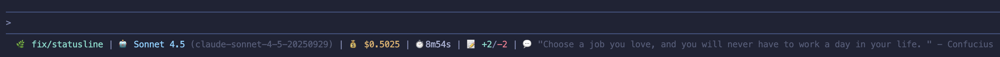

# CC Marketplace for Claude Code

[English version](README.md)

本リポジトリは Claude Code のマーケットプレイスバンドル（cc-marketplace）を提供します。

同梱プラグイン：

- [`gh`](#gh-プラグイン): 変更を分析し、適切に構造化された PR を自動生成するプラグイン
- [`statusline`](#statusline-プラグイン): ブランチ・モデル・コスト・所要時間・差分行数・名言を表示するシェル用ステータスラインをインストール

## 機能

### gh プラグイン

- **インテリジェント分析**: git の変更、コミット、差分を自動的に分析
- **スマートな PR 生成**: 適切なフォーマットで包括的な PR 説明を作成
- **柔軟なオプション**: ドラフト PR、カスタムベースブランチ、レビュアー指定をサポート
- **エラーハンドリング**: 明確なエラーメッセージと実行可能な解決策を提供
- **GitHub 統合**: GitHub CLI (`gh`) とシームレスに統合

### statusline プラグイン

- **豊富なセッション情報**: ブランチ、モデル、コスト、所要時間、変更行数を表示
- **リアルタイム更新**: Claude Code セッション中にリアルタイムで更新
- **名言表示**: 5 分ごとに新しいプログラミング名言を表示（キャッシュ機能付き）
- **カラー表示**: 絵文字とカラーコードで視覚的に見やすく表示

## 必要要件

### gh プラグイン用

- [Claude Code](https://claude.ai/download) がインストール済み
- `git` がインストールされ `PATH` から実行可能
- [GitHub CLI (`gh`)](https://cli.github.com/) がインストールされ認証済み
- PR を作成する変更がある git リポジトリ

### statusline プラグイン用

- [Claude Code](https://claude.ai/download) がインストール済み
- `jq` がインストールされ `PATH` から実行可能（JSON 解析用）
- `curl` がインストール済み（名言取得用、オプション）
- git リポジトリ（ブランチ表示用、オプション）

## インストール

### GitHub から（推奨）

```bash
/plugin marketplace add setouchi-h/cc-marketplace
# gh プラグインのインストール
/plugin install gh@cc-marketplace
# statusline プラグインのインストール
/plugin install statusline@cc-marketplace
```

### ローカルディレクトリから

```bash
cd /path/to/cc-marketplace
/plugin install .
```

---

## gh プラグイン

### 基本的な使い方

Claude Code でコマンドを実行するだけです：

```bash
/gh:create-pr
```

プラグインは以下を実行します：

1. 現在のブランチと変更を分析
2. 包括的な PR タイトルと説明を生成
3. 必要に応じてブランチをプッシュ
4. GitHub でプルリクエストを作成
5. PR URL を表示

### フラグ

- `-d, --draft`: ドラフト PR として作成
- `-b, --base <branch>`: 既定のベースブランチの代わりに使用（既定はリポジトリのデフォルトブランチ。一般的に `main` または `master`）
- `-r, --reviewer <user>`: 指定した GitHub ユーザーをレビュアーに追加。複数追加する場合はフラグを繰り返し指定
- `--no-push`: PR 作成前のブランチのプッシュをスキップ
- `--assign-me`: 認証ユーザー（`@me`）をアサインしようと試みます。アサインは PR 作成後に実行され、権限がない場合は警告のみ表示し、PR 作成自体は成功のままにします。

短縮形を使った例：

```bash
# カスタムベースのドラフトPR。レビュアーを2名追加
/create-pr -d -b develop -r alice -r bob
```

### 動作の仕組み

1. **ブランチ分析**: 現在のブランチステータスとリモートトラッキングを確認
2. **変更検出**: ベースブランチからのコミットと差分を分析
3. **コンテンツ生成**: 以下を含む PR を作成：
   - 簡潔で説明的なタイトル（命令形、72 文字未満）
   - 包括的な説明：
     - 変更の概要
     - 詳細な変更リスト
     - 動機と文脈
     - テスト情報
     - 追加の注記
4. **PR 作成**: `gh pr create` を使用してプルリクエストを作成
5. **結果表示**: PR URL と概要を表示

### 権限

このプラグインは以下のローカルコマンドを呼び出します：

- `git` — ステータス、ブランチ、コミット、差分の取得のため
- `gh` — GitHub CLI を用いたプルリクエスト作成のため

既存の `gh auth login` セッションに依存し、認証情報をプラグイン側で保存しません。

### PR 説明の例

プラグインは以下の構造で PR を生成します：

```markdown
## Summary

この PR が達成する内容の簡単な概要

## Changes

- 主な変更や機能 1
- 主な変更や機能 2
- 主な変更や機能 3

## Motivation

これらの変更が必要な理由の説明

## Testing

- 変更がどのようにテストされたか
- テスト結果または検証手順

## Notes

追加の文脈、破壊的変更、またはレビュアーへの注記
```

---

## statusline プラグイン

### 概要

statusline プラグインは、Claude Code セッションに関する豊富な情報を表示するカスタマイズ可能なステータスラインスクリプトをインストールします。現在の git ブランチ、AI モデル、セッションコスト、所要時間、変更行数、プログラミング名言などを表示します。

### 表示内容

ステータスラインには以下の情報が表示されます：

- 🌿 **現在のブランチ**: Git ブランチ名（例：`main`、`feature/new-ui`）
- 🤖 **モデル**: AI モデル名と ID（例：`Sonnet 4.5`）
- 💰 **コスト**: セッション全体のコスト（USD）（例：`$0.0123`）
- ⏱️ **所要時間**: セッションの経過時間（分/秒）（例：`1m49s`）
- 📝 **変更**: 追加/削除された行数（例：`+10/-2`）
- 💬 **名言**: ランダムなプログラミング名言（5 分ごとに更新）

出力例：



### インストール

#### ステップ 1: プラグインのインストール

```bash
/plugin marketplace add setouchi-h/cc-marketplace
/plugin install statusline@cc-marketplace
```

#### ステップ 2: インストールコマンドの実行

```bash
/statusline:install-statusline
```

このコマンドは以下を実行します：

- `jq` がインストールされているか確認（JSON 解析に必要）
- `~/.claude/scripts/` ディレクトリが存在しない場合は作成
- `~/.claude/scripts/statusline.sh` にステータスラインスクリプトを書き込み
- スクリプトを実行可能にする

#### ステップ 3: Claude Code の設定

`~/.config/claude/config.json` を編集して、ステータスラインを Claude Code の設定に追加します：

```json
{
  "statusline": {
    "command": "~/.claude/scripts/statusline.sh"
  }
}
```

または、Claude Code の設定 UI を使用してステータスラインコマンドのパスを設定します。

#### インストールまたは更新

```bash
# 初回インストール
/statusline:install-statusline

# 強制的に再インストール（既存のスクリプトを上書き）
/statusline:install-statusline --force
```

#### ステータスラインのプレビュー

フルセッションを開始せずにステータスラインをテストします：

```bash
/statusline:preview-statusline
```

これにより、モックデータを使用してサンプルのステータスラインがレンダリングされ、色とレイアウトを確認できます。

### 動作の仕組み

1. **JSON 入力**: Claude Code がセッションデータを JSON として標準入力経由でスクリプトに渡します
2. **データ抽出**: スクリプトは `jq` を使用して以下を解析します：
   - セッションのコストと所要時間
   - 追加/削除された行数
   - モデル名と ID
   - ワークスペースディレクトリ
3. **Git ブランチ**: ワークスペースから現在の git ブランチを検出
4. **名言の取得**:
   - [ZenQuotes API](https://zenquotes.io/) からランダムな名言を取得
   - API 呼び出しを減らすため、名言を 5 分間キャッシュ
   - オフライン時はキャッシュまたはデフォルトの名言にフォールバック
5. **フォーマット**: 絵文字と ANSI カラーコードを使用して 1 行を出力

### 必要要件

- **jq**: JSON 解析に必須
  - macOS: `brew install jq`
  - Linux: `sudo apt-get install jq` または `sudo yum install jq`
  - Windows: [jqlang.github.io](https://jqlang.github.io/jq/download/) からダウンロード
- **curl**: 名言の取得に使用（オプション、利用できない場合は適切に動作を低下）
- **git**: ブランチ名の表示に使用（オプション）

## 貢献

貢献を歓迎します！Issue や Pull Request をお気軽に送信してください。

1. リポジトリをフォーク
2. フィーチャーブランチを作成
3. 変更をコミット
4. ブランチにプッシュ
5. Pull Request を作成

## ライセンス

MIT License - 詳細は [LICENSE](LICENSE) ファイルを参照してください
