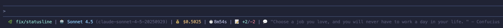

# CC Marketplace for Claude Code

[日本語版はこちら](README.ja.md)

This repository provides a Claude Code marketplace bundle (cc-marketplace).

Included plugins:

- [`statusline`](#statusline-plugin): Installs a shell status line for Claude Code showing branch, model, cost, duration, diff lines, and an optional quote.
- [`gh`](#gh-plugin): Intelligent PR creation tool that analyzes your changes and creates well-structured pull requests automatically.
- [`git`](#git-plugin): Git workflow automation with git-flow style commit messages and automatic push.

## Features

### statusline Plugin

- **Rich Session Info**: Displays branch, model, cost, duration, and line changes
- **Real-time Updates**: Updates as you work in your Claude Code session
- **Inspiring Quotes (optional)**: Shows a new quote every 5 minutes (cached). Disable with `--no-quotes`.
- **Color-Coded Display**: Uses emojis and colors for easy visual parsing
- **Offline Support**: Gracefully falls back when offline

### gh Plugin

- **Intelligent Analysis**: Automatically analyzes your git changes, commits, and diffs
- **Smart PR Generation**: Creates comprehensive PR descriptions with proper formatting
- **Flexible Options**: Supports draft PRs, custom base branches, and reviewer assignments
- **Error Handling**: Provides clear error messages and actionable solutions
- **GitHub Integration**: Seamlessly integrates with GitHub CLI (`gh`)

### git Plugin

- **Git-Flow Style Commits**: Automatically generates conventional commit messages following git-flow standards
- **Smart Type Detection**: Analyzes changes to determine commit type (feat, fix, docs, etc.)
- **Scope Suggestion**: Suggests appropriate scope based on changed files and directories
- **Secret Scanning**: Scans for potential secrets before committing
- **Auto-Push**: Optionally pushes commits to remote after committing
- **Interactive Workflow**: Confirms each step before execution

## Prerequisites

### For statusline Plugin

- [Claude Code](https://claude.ai/download) installed
- `jq` installed and available in `PATH` (for JSON parsing)
- `curl` installed (for fetching quotes, optional)
- A git repository (optional, for branch display)

### For gh Plugin

- [Claude Code](https://claude.ai/download) installed
- `git` installed and available in `PATH`
- [GitHub CLI (`gh`)](https://cli.github.com/) installed and authenticated
- A git repository with changes to create a PR from

### For git Plugin

- [Claude Code](https://claude.ai/download) installed
- `git` installed and available in `PATH`
- A git repository with changes to commit

## Installation

### From GitHub (Recommended)

```bash
/plugin marketplace add setouchi-h/cc-marketplace
# Install statusline plugin
/plugin install statusline@cc-marketplace
# Install gh plugin
/plugin install gh@cc-marketplace
# Install git plugin
/plugin install git@cc-marketplace
```

---

## statusline Plugin

### Overview

The statusline plugin installs a customizable status line script that displays rich information about your Claude Code session. It shows the current git branch, AI model, session cost, duration, changed lines, and optionally a quote.

### What It Displays

The status line shows:

- 🌿 **Current Branch**: Git branch name (e.g., `main`, `feature/new-ui`)
- 🤖 **Model**: AI model name and ID (e.g., `Sonnet 4.5`)
- 💰 **Cost**: Total session cost in USD (e.g., `$0.0123`)
- ⏱️ **Duration**: Session duration in minutes/seconds (e.g., `1m49s`)
- 📝 **Changes**: Lines added/removed (e.g., `+10/-2`)
- 💬 **Quote (optional)**: Random quote (refreshed every 5 minutes)

Example output:



### Installation

#### Step 1: Install the Plugin

```bash
/plugin marketplace add setouchi-h/cc-marketplace
/plugin install statusline@cc-marketplace
```

#### Step 2: Run the Install Command

```bash
/statusline:install-statusline
```

This command:

- Checks if `jq` is installed (required for JSON parsing)
- Creates `~/.claude/scripts/` directory if it doesn't exist
- Writes the status line script to `~/.claude/scripts/statusline.sh`
- Makes the script executable
- Automatically configures `~/.claude/settings.json` to enable the status line

Disable quotes at install time:

```bash
/statusline:install-statusline --no-quotes
```
This writes `bash ~/.claude/scripts/statusline.sh --no-quotes` into `~/.claude/settings.json` so the quote section is hidden.

#### Preview the Status Line

Test the status line without starting a full session:

```bash
/statusline:preview-statusline
```

This renders a sample status line using mock data to verify colors and layout.

### How It Works

1. **JSON Input**: Claude Code passes session data as JSON to the script via stdin
2. **Data Extraction**: The script uses `jq` to parse:
   - Session cost and duration
   - Lines added/removed
   - Model name and ID
   - Workspace directory
3. **Git Branch**: Detects the current git branch from the workspace
4. **Quote Fetching (if enabled)**:
   - Fetches a random quote from [ZenQuotes API](https://zenquotes.io/)
   - Caches quotes for 5 minutes to reduce API calls
   - Falls back to cached or default quotes when offline
5. **Formatting**: Outputs a single line with emojis and ANSI color codes

### Requirements

- **jq**: Required for JSON parsing
  - macOS: `brew install jq`
  - Linux: `sudo apt-get install jq` or `sudo yum install jq`
  - Windows: Download from [jqlang.github.io](https://jqlang.github.io/jq/download/)
- **curl**: Optional, for fetching quotes (degrades gracefully if unavailable)
- **git**: Optional, for displaying branch name

#### Hide Quotes Later (without reinstall)

- Temporary: set an environment variable when running the script directly or via preview:

```bash
CLAUDE_STATUSLINE_NO_QUOTES=1 ~/.claude/scripts/statusline.sh
```

- Persistent: add `--no-quotes` to the command in `~/.claude/settings.json`, e.g.:

```json
{
  "statusLine": {
    "type": "command",
    "command": "bash ~/.claude/scripts/statusline.sh --no-quotes"
  }
}
```

You can also rerun the installer with `--force --no-quotes` to update the configuration automatically.

---

## gh Plugin

### Basic Usage

Simply run the command in Claude Code:

```bash
/gh:create-pr
```

The plugin will:

1. Analyze your current branch and changes
2. Generate a comprehensive PR title and description
3. Push your branch if needed
4. Create the pull request on GitHub
5. Display the PR URL

### Flags

- `-d, --draft`: Create as a draft PR
- `-b, --base <branch>`: Use an alternate base branch. Defaults to the repository's default branch (commonly `main` or `master`).
- `-r, --reviewer <user>`: Add a GitHub username as a reviewer. Repeat the flag to add multiple reviewers.
- `--no-push`: Skip pushing the current branch before creating the PR.
- `--no-assign`: Skip assigning the PR to yourself. By default, the PR is assigned to the authenticated user (`@me`). Assignment happens after the PR is created; if assignment isn't permitted, a warning is shown and PR creation still succeeds.

Examples with short flags:

```bash
# Draft PR against a custom base with two reviewers
/create-pr -d -b develop -r alice -r bob
```

### How It Works

1. **Branch Analysis**: Checks your current branch status and remote tracking
2. **Change Detection**: Analyzes commits and diffs since the base branch
3. **Content Generation**: Creates a PR with:
   - Concise, descriptive title (imperative mood, <72 chars)
   - Comprehensive description including:
     - Summary of changes
     - Detailed change list
     - Motivation and context
     - Testing information
     - Additional notes
4. **PR Creation**: Uses `gh pr create` to create the pull request
5. **Result Display**: Shows the PR URL and summary

### Permissions

This plugin invokes the following local commands:

- `git` — to inspect status, branches, commits, and diffs
- `gh` — to create the pull request via GitHub CLI

It relies on your existing `gh auth login` session and does not store credentials itself.

### Example PR Description

The plugin generates PRs with this structure:

```markdown
## Summary

Brief overview of what this PR accomplishes

## Changes

- Key change or feature 1
- Key change or feature 2
- Key change or feature 3

## Motivation

Explanation of why these changes were needed

## Testing

- How the changes were tested
- Test results or validation steps

## Notes

Any additional context, breaking changes, or reviewer notes
```

---

## git Plugin

### Overview

The git plugin automates the git commit workflow with git-flow style conventional commit messages. It analyzes your changes, generates appropriate commit messages, and optionally pushes to the remote repository.

### Basic Usage

Simply run the command in Claude Code:

```bash
/git:commit
```

The plugin will:

1. Analyze your staged and unstaged changes
2. Detect the appropriate commit type (feat, fix, docs, etc.)
3. Suggest a scope based on changed files
4. Generate a git-flow style commit message
5. Ask for your confirmation
6. Create the commit
7. Push to remote (unless --no-push is specified)

### Commit Types

The plugin uses conventional commit types:

- `feat`: A new feature
- `fix`: A bug fix
- `docs`: Documentation only changes
- `style`: Formatting, white-space, missing semi-colons, etc.
- `refactor`: Code change that neither fixes a bug nor adds a feature
- `perf`: Performance improvement
- `test`: Adding or correcting tests
- `chore`: Build process, tools, library updates
- `ci`: CI/CD configuration changes

### Flags

- `--no-push`: Create the commit but don't push to remote
- `--scope <scope>`: Manually specify the commit scope (e.g., "auth", "api")
- `--type <type>`: Force a specific commit type instead of auto-detection

Examples:

```bash
# Commit with auto-detection and push
/git:commit

# Commit without pushing
/git:commit --no-push

# Force a specific type and scope
/git:commit --type feat --scope auth

# Specify only the scope
/git:commit --scope api
```

### Commit Message Format

Generated commit messages follow the conventional commit format:

```
<type>(<scope>): <subject>

<body>

<footer>
```

Example:

```
feat(auth): add OAuth2 authentication flow

Implement OAuth2 authentication with Google and GitHub providers.
Add token refresh mechanism and session management.

Closes #123
```

### How It Works

1. **Context Gathering**: Analyzes current branch, staged/unstaged changes, and recent commits
2. **Change Analysis**: Determines commit type based on:
   - Files changed (e.g., `*.md` files → `docs`)
   - Content of diffs (e.g., test files → `test`)
   - Directory structure (e.g., `.github/` → `ci`)
3. **Scope Detection**: Suggests scope from:
   - Package names (e.g., `packages/auth` → scope: `auth`)
   - Directory names
   - Module names
4. **Secret Scanning**: Checks for potential secrets:
   - API keys (AKIA, ghp_, sk-, etc.)
   - Private keys
   - Tokens and passwords
   - Sensitive environment files
5. **Staging**: Helps stage unstaged files if needed
6. **Commit Creation**: Creates the commit with the generated message
7. **Push**: Pushes to remote with appropriate upstream tracking

### Security Features

The plugin includes built-in secret scanning that checks for:

- API keys and tokens
- Private keys (RSA, SSH, etc.)
- Passwords and credentials
- Sensitive data patterns

If suspicious content is detected, the plugin will:
- Show a warning with masked snippets
- Ask for explicit confirmation
- Default to canceling the commit

### Example Workflow

```
You: /git:commit

Claude: I've analyzed your changes and detected the following:
- Type: feat (new feature detected)
- Scope: auth (based on packages/auth/ changes)
- Files: 3 files changed, 45 insertions(+), 12 deletions(-)

Proposed commit message:
━━━━━━━━━━━━━━━━━━━━━━━━━━━━━━━━━━━━━━━━
feat(auth): add OAuth2 authentication flow

Implement OAuth2 authentication with Google and GitHub providers.
Add token refresh mechanism and session management.
━━━━━━━━━━━━━━━━━━━━━━━━━━━━━━━━━━━━━━━━

Would you like to proceed with this commit message? (yes/no/edit)

You: yes

Claude: ✓ Commit created successfully
✓ Pushing to origin/your-branch...
✓ Push completed

Summary:
- Commit: feat(auth): add OAuth2 authentication flow
- Branch: your-branch
- Files changed: 3
- Push status: success
```

### Permissions

This plugin invokes the following local commands:

- `git status` — to inspect working tree status
- `git diff` — to analyze changes
- `git add` — to stage files
- `git commit` — to create commits
- `git push` — to push to remote
- `git branch` — to get current branch
- `git log` — to analyze recent commit patterns

It does not store credentials and uses your existing git configuration.

## Contributing

Contributions are welcome! Please feel free to submit issues or pull requests.

1. Fork the repository
2. Create your feature branch
3. Commit your changes
4. Push to the branch
5. Create a Pull Request

## License

MIT License - see [LICENSE](LICENSE) file for details
