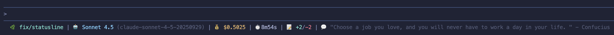

# CC Marketplace for Claude Code

[日本語版はこちら](README.ja.md)

Claude Code marketplace bundle with essential development plugins.

## Plugins

- **statusline**: Rich status line showing branch, model, cost, duration, and changes
- **gh**: Automated PR creation with intelligent analysis
- **git**: Git-flow workflow automation (branch creation, conventional commits)
- **xcode**: Build and run Xcode projects on simulators or physical devices
- **fxembed**: Fetch X (Twitter) tweets and profiles via the FxEmbed JSON API

## Installation

```bash
/plugin marketplace add setouchi-h/cc-marketplace
/plugin install statusline@cc-marketplace
/plugin install gh@cc-marketplace
/plugin install git@cc-marketplace
/plugin install xcode@cc-marketplace
/plugin install fxembed@cc-marketplace
```

## Usage

### statusline

The statusline plugin displays rich session information in your Claude Code prompt.



**What it shows:**
- 🌿 Current git branch
- 🤖 AI model (e.g., Sonnet 4.5)
- 💰 Session cost in USD
- ⏱️ Duration (e.g., 1m49s)
- 📝 Lines changed (+10/-2)
- 💬 Optional quote (refreshed every 5 minutes)

**Requirements:**
- `jq` must be installed (for JSON parsing)
- `curl` optional (for quotes feature)

**Installation:**
```bash
# Step 1: Install the plugin
/plugin install statusline@cc-marketplace

# Step 2: Run the installer
/statusline:install-statusline

# Optional: Install without quotes
/statusline:install-statusline --no-quotes

# Preview before full session
/statusline:preview-statusline
```

The installer creates `~/.claude/scripts/statusline.sh` and automatically configures your `~/.claude/settings.json`.

### gh

Create pull requests with intelligent analysis.

```bash
/gh:create-pr                         # Create PR from current branch
/gh:create-pr -d -b develop          # Draft PR against develop
/gh:create-pr -r alice -r bob        # Add reviewers
```

**Flags:**
- `-d, --draft`: Create as draft PR
- `-b, --base <branch>`: Specify base branch (default: repo default)
- `-r, --reviewer <user>`: Add reviewer (repeat for multiple)
- `--no-push`: Skip pushing branch
- `--no-assign`: Skip self-assignment

### git

Git-flow workflow automation with branch creation and conventional commits.

```bash
/git:create-branch "task description" # Create git-flow branch
/git:create-branch "fix bug" --type bugfix --base main
/git:commit                           # Conventional commit with auto-detection
/git:commit --type feat --scope auth --no-push
```

**create-branch flags:**
- `--base <branch>`: Specify base branch (default: auto-detect)
- `--type <type>`: Force branch type (feature/bugfix/hotfix/release)
- `--no-push`: Don't push to remote

**commit flags:**
- `--type <type>`: Force commit type (feat/fix/docs/etc.)
- `--scope <scope>`: Specify commit scope
- `--no-push`: Don't push to remote

### xcode

Build and run Xcode projects on iOS simulators or physical devices.

```bash
/xcode:run                                           # Auto-detect and run
/xcode:run --simulator "iPhone 15 Pro"               # Specific simulator
/xcode:run --scheme MyApp --simulator "iPad Pro"     # Scheme + simulator
/xcode:run --device "My iPhone"                      # Physical device
/xcode:run --clean --configuration Release           # Clean Release build
```

**Flags:**
- `--scheme <name>`: Specify build scheme (required if multiple exist)
- `--simulator <name>`: Run on simulator (e.g., "iPhone 15 Pro")
- `--device <name>`: Run on connected physical device
- `--clean`: Perform clean build
- `--configuration <config>`: Build configuration (Debug/Release, default: Debug)

**Requirements:**
- Xcode and command line tools must be installed
- For physical devices, proper code signing configuration required

### fxembed

Lets Claude read X (Twitter) content. X blocks unauthenticated access, so direct
fetches of `x.com` links fail — this skill teaches Claude to rewrite tweet URLs
to the [FxEmbed](https://github.com/FxEmbed/FxEmbed) JSON API
(`api.fxtwitter.com`) and fetch them with curl. No slash command needed: once
installed, the skill activates automatically whenever a tweet URL comes up.

```
https://x.com/user/status/123  →  https://api.fxtwitter.com/2/status/123
```

**What it covers:**
- Tweet text, author, metrics, media links, quote tweets, and polls as JSON
- User profiles (`/2/profile/{screen_name}`)
- Search (`/2/search`) and user timelines (`/2/profile/{screen_name}/statuses`)
- Direct media downloads via `d.fxtwitter.com`
- Treating fetched content as untrusted data (prompt-injection guidance)
- Fallback to vxTwitter when FxEmbed is down

**Limitations:**
- Public content only (protected accounts return 401, deleted tweets 404)

## License

MIT
